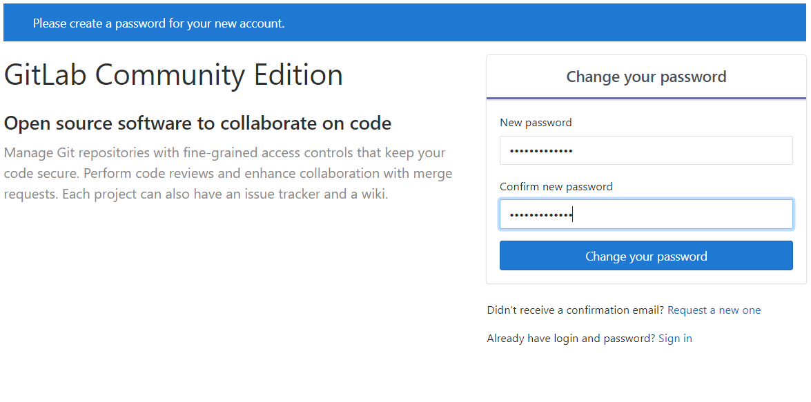
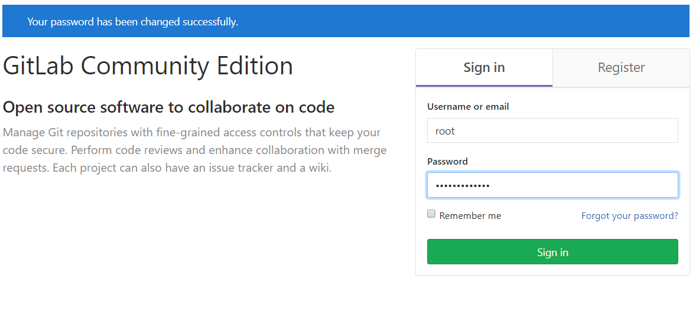

# Gitlab安装

- 官网  
https://docs.gitlab.com/ee/install/docker.html

- 安装  
```
    sudo docker run -d --restart=unless-stopped \
    -v /data/gitlab/etc:/etc/gitlab \
    -v /data/gitlab/log:/var/log/gitlab \
    -v /data/gitlab/data:/var/opt/gitlab \
    -p 8022:22 \
    -p 8091:8091 \
    --name gitlab \
    gitlab/gitlab-ce:11.4.4-ce.0
```

- 修改配置文件  
vi /data/gitlab/etc/gitlab.rb  
```
external_url 'http://192.168.0.68:8091' # 默认会使用主机名生成url，改为ip
gitlab_rails['gitlab_ssh_host'] = '192.168.0.68' # 默认会使用主机名生成url，改为ip
gitlab_rails['gitlab_shell_ssh_port'] = 8022 # 根据实际情况修改ssh端口
gitlab_rails['time_zone'] = 'Asia/Shanghai' # 修改时区
```

- 重启gitlab  
docker restart gitlab

- 在浏览器打开<http://192.168.0.68:8091/>，设置root的密码  


- 使用刚设置的密码登录  
