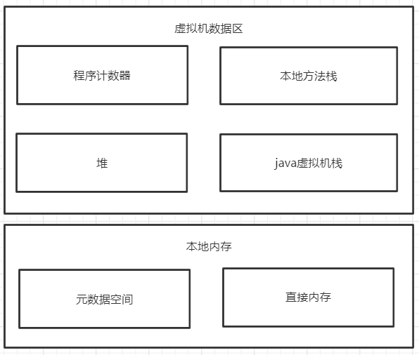

# JAVA基础

## 英文自我介绍
```
Hi everyone, thank you for giving me this interview opportunity.
My name is Joe, come from Guangdong Yangchun, graduated in 2008 and worked for more than 10 years.

The first job in a company to managed linux server. The second job in a insurance company participate in
the development of insurance management system. The third job in 中山大学 develop school management system.

Since August 2018, entered 广东旅划算 company, in the sharing middle-end team, responsible for 


That’s all. Thank you for giving me the chance.
```
## JVM内存模型
### JVM 1.7内存模型


### JVM 1.8内存模型


## 垃圾回收机制
### 判断对象是否存活算法
#### 引用计数法
为每个创建的对象分配一个引用计数器，用来存储引用的个数。该个数为零，则可以认为对象死亡。改算法的缺陷是无法检测“循环引用”

#### 可达性分析
以GC Roots为起点向下搜索，走过的路径为引用链，如果一个对象没有通过引用链连接到GC Roots，证明该对象不可用。

可作为GC Root的对象：
- 虚拟机栈（栈帧中的局部变量表）中的引用的对象
- 方法区中类静态属性引用的对象
- 方法区中常量引用的对象
- 本地方法栈中JNI（即一般说的Native方法）引用的对象

## 泛型
泛型的本质是参数化类型，提高java程序的类型安全，提供编译期间的类型检测，消除强制类型转换，泛化代码，代码可以更多的重复利用

## 反射
java的反射机制是指在运行时可以动态加载类，查看类的信息，生成对象，操作对象，获取对象信息。

## 集合


## 多线程
### 线程生命周期

- sleep: 不需要在同步方法或同步块中调用，java.lang.Thread的静态方法，作用于当前线程，不会释放锁，超时或调用interrupt()可以呼醒；
- wait: 只能在同步方法或同步块中调用，否则抛IllegalMonitorStateException异常，Object类中的方法，作用于对象本身，其他线程调用对象的notify()或notifyAll()可以呼醒；
- join：thread.join()的作用是把当前线程放入等待池，并等待thread线程执行完毕后才会被呼醒，但不影响同一时刻处在运行状态的其他线程；
- yield: 放弃当期cpu的执行权；
- interrupt: 改变中断状态，不会中断运行中的线程，抛出一个InterruptException，从而提早退出阻塞状态；

### ThreadPoolExecutor处理流程


### 线程分类
1. newCachedThreadPool 可缓存线程池，核心线程数为0，最大线程数为Integer.MAX_VALUE，默认存储队列为SynchronousQueue
2. newFixedThreadPool 固定大小线程池，核心线程数和最大线程数为构造参数值，默认存储队列为LinkedBlockingQueue，无界队列
3. newSingleThreadExecutor 单一线程线程池，核心线程数和最大线程数为1，默认存储队列为LinkedBlockingQueue，无界队列
4. newScheduleThreadPool 固定大小线程池，支持定时和周期性任务，核心线程数为构造参数值，最大线程数为Integer.MAX_VALUE，默认存储队列为DelayedWorkQueue

### 线程配置参数
- corePoolSize: 核心线程数
- maximumPoolSize: 最大线程数
- keepAliveTime: 保持存活时间
- timeUnit: 保持存活时间单位
- workQueue: 任务存储队列
- threadFactory: 线程创建工厂
- rejectedExecutionHandler: 拒绝策略 

### 线程任务存储队列
- ArrayBlockingQueue (int i): 有界数组队列，FIFO
- LinkedBlockingQueue () 或者 (int i): 有界或无界链表队列，FIFO
- PriorityBlockingQueue () 或者 (int i): 类似于LinkedBlockingQueue，排序不是FIFO，由构造函数的Comparator决定
- SynchronousQueue (): 不存储元素的阻塞队列

### 线程拒绝策略
- CallerRunsPolicy: 在调用者线程执行
- AbortPolicy: 直接抛出RejectedExecutionException异常
- DiscardPolicy: 任务直接丢弃，不做任何处理
- DiscardOldestPolicy:  丢弃队列里最旧的那个任务，再尝试执行当前任务

## 设计模式 


### 开发原则  
1. 开闭原则
2. 里氏替换原则
3. 依赖倒置原则
4. 单一职责原则
5. 接口隔离原则
6. 迪米特法则

### 创建型
1. 单例模式
2. 原型模式
3. 工厂方法模式
4. 抽象工厂模式
5. 建造者模式

### 结构性
1. 代理模式
2. 适配器模式
3. 桥接模式
4. 装饰模式
5. 外观模式
6. 享元模式
7. 组合模式

### 行为性
1. 模板方法模式
2. 策略模式
3. 命令模式
4. 责任链模式
5. 状态模式
6. 观察者模式

## AOP
面向切面编程，使用动态代理实现，包含连接点，切入点，前置通知，后置通知，返回通知，异常通知，环绕通知。

## IoC

## 动态代理


## 分布式事务

## JDK8新特性
1. 增加了Lambda表达式和函数式编程
2. 增加了方法和构造函数的引用
3. 接口增强了，增加了默认方法和静态方法
4. 集合引入了流式操作，流操作分为中间操作和最终操作，流并发分为串行流和并行流，实现了集合的过滤、排序和映射等操作
5. 增加了Optional、Predicate、Function、Supplier、Consumer、Comparator等接口
6. 增加了全新的Date API, 在java.time包，有LocalDateTime，LocalDate，LocalTime, Clock, Timezones, Instant, DateTimeFormatter


## SpringBoot组件
### 四大核心
- AutoConfig自动配置
- Starter起步依赖
- Actuator监控
- 命令行界面

### 常用组件
- Web Starter
- Test Starter
- Data JPA Starter
- Mail Starter

## SpringCloud组件
- Config
- Eureka
- Zuul
- Security
- Zipkin
- Hystrix
- Feign Client
- Ribbon
- Turbine
- Spring Boot Admin

## JWT组成


## Dockerfile常用指令
FROM 设置基础镜像
MAINTAINER 设置镜像作者
RUN 运行的脚步
CMD 容器启动后默认执行命令，docker run和dockerfile没指定ENTRYPOINT时执行
LABEL 设置的标签
EXPOSE 设置暴露的端口
ENV 设置环境变量
ADD 复制文件到镜像中，支持网络地址，自解压
COPY 复制文件到镜像中，不支持网络地址，不自解压
ENTRYPOINT 设置容器的入口程序
VOLUME 设置挂载卷
USER 设置运行用户
WORKDIR 设置工作目录
ARG 设置编译容器时加入的参数

## 什么开发模式可以避免OOM

## 中台
### 用户中台
权限依赖于系统，数据依赖于组织
- 系统
- 资源
- 权限
- 角色
- 用户
- 组织
- 菜单权限
- 按钮权限
- 数据权限


### 支付中台

### 数据中台

## 架构文档输出
1. pdm
2. 业务流程图（UML状态图）
3. UML用例图
4. UML时序图
5. api接口文档
6. 领域模型图

## UML符号

## Kafka为什么快
1. kafka采用的是顺序IO写入
2. 采用内存映射文件（Memory Mapped Files）,利用操作系统的分页存储来实现内存和文件的直接映射，落盘分为异步和同步，由producer.type控制
3. 读取数据采用了基于sendfile的zero copy，传统方式“硬盘—>内核buf—>用户buf—>socket相关缓冲区—>协议引擎”， sendfile减少了copy到用户buf一步
4. 采用批量压缩消息，降低网络IO的使用

## redis遇到瓶颈怎么处理

## DDD


### 领域对象（entity）
- 聚合根
- 实体
- 值对象
- 领域的数据与行为
- 数据和行为应该与业务产品上的行为关联。领域对象通常是有状态的，理想情况下，我们的领域对象行为应该和产品业务定义意义映射
- 领域对象不应该与其他的模型有交互，不应该持久化数据

### 领域服务（service）
- 构造（复杂）的领域对象
- 与repository打交道
- 调用其他限界上下文的内容
- 提供领域方法给其他界限上下文/应用程序调用

## 谈谈你对OOP的理解

## 谈谈三大范式及MySQL出现慢查询的优化步骤

## Spring事务的隔离级别及传播行为
PROPAGATION_REQUIRED--支持当前事务，如果当前没有事务，就新建一个事务。这是最常见的选择。 
PROPAGATION_SUPPORTS--支持当前事务，如果当前没有事务，就以非事务方式执行。 
PROPAGATION_MANDATORY--支持当前事务，如果当前没有事务，就抛出异常。 
PROPAGATION_REQUIRES_NEW--新建事务，如果当前存在事务，把当前事务挂起。 
PROPAGATION_NOT_SUPPORTED--以非事务方式执行操作，如果当前存在事务，就把当前事务挂起。 
PROPAGATION_NEVER--以非事务方式执行，如果当前存在事务，则抛出异常。 

## 谈谈你对JVM调优的思路

## 谈谈CAS和Oauth2的特性，你在什么场景下用过

## 描述下你主导或参与的一个系统架构，提出其优点

## 写一篇架构设计文档，你会包含哪几方面来描述

## 和同事的设计思路不一样怎么处理


