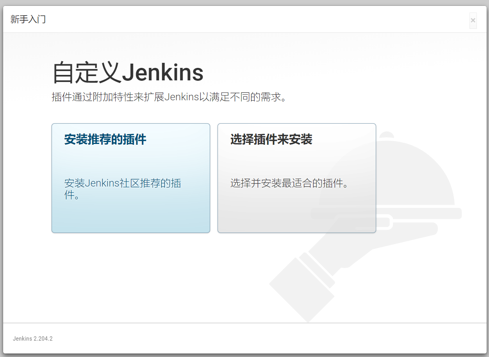
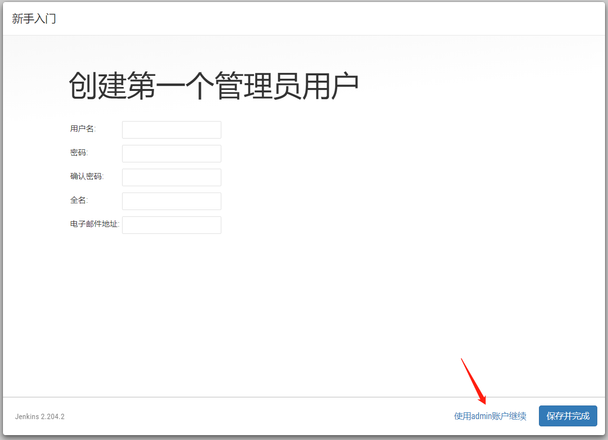
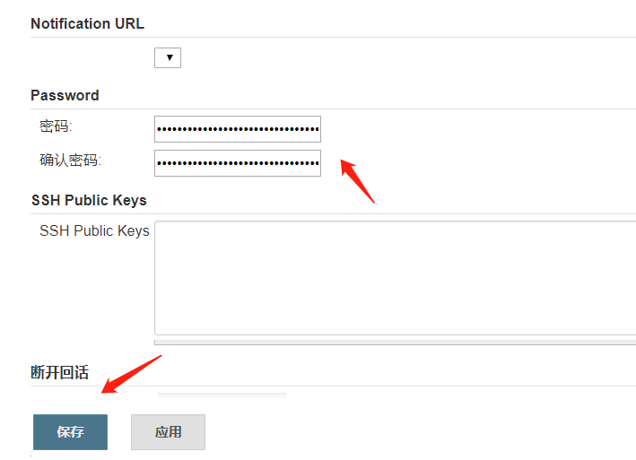
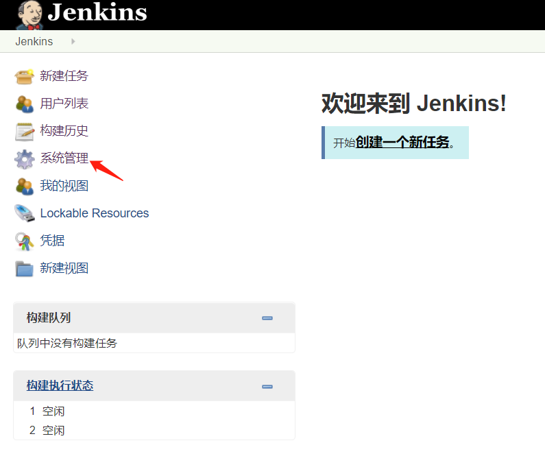
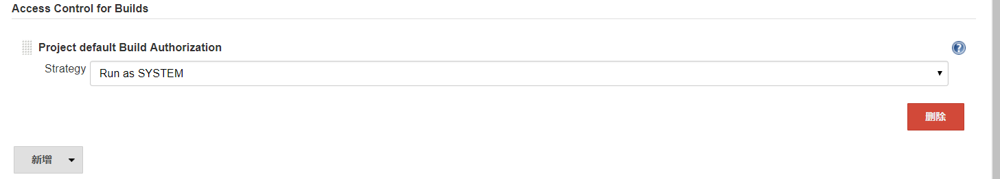
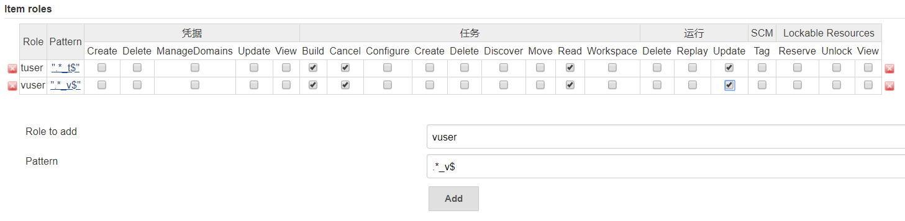

# Jenkins安装

## 构建docker镜像
- 下载Dockerfile  
wget https://www.gaozhengzhou.com/jenkins/Dockerfile

- 构建镜像  
docker build --tag=registry-vpc.cn-shenzhen.aliyuncs.com/lhs11/jenkins:latest .

- 推送镜像到私有仓库  
docker push registry-vpc.cn-shenzhen.aliyuncs.com/lhs11/jenkins:latest

## Master节点部署
### Docker环境    
docker run -d --restart=unless-stopped -p 30010:8080 -p 50000:50000 -v /var/run/docker.sock:/var/run/docker.sock -v /usr/bin/docker:/usr/bin/docker -v /data:/data registry-vpc.cn-shenzhen.aliyuncs.com/lhs11/jenkins:latest

### Kubernetes环境  
kubectl apply -f jenkins.yml  

```jenkins.yml
apiVersion: v1
kind: Namespace
metadata:
  name: ldx

---
# execute flow command to get .dockerconfigjson string
# docker login --username=test --password=123456 registry-vpc.cn-shenzhen.aliyuncs.com
# cat /root/.docker/config.json | base64 -w 0
kind: Secret
apiVersion: v1
metadata:
  name: ldx-registry-key
  namespace: ldx
data:
  .dockerconfigjson: 1dGhzIjogewoJCSJyZWdpc3RyeS12cGMuY24tc2hlbnpoZW4uYWxpeXVuY3MuY29tIjogewoJCQkiYXV0aCI6ICJhbTlsUURFeU1UTXhNelUxTWpNd01USXpOVEU2Ykdoek1UUTNNalU0IgoJCX0sCgkJInJlZ2lzdHJ5LmNuLXNoZW56aGVuLmFsaXl1bmNzLmNvbSI6IHsKCQkJImF1dGgiOiAiYW05bFFERXlNVE14TXpVMU1qTXdNVEl6TlRFNmJHaHpNVFEzTWpVNCIKCQl9Cgl9LAoJIkh0dHBIZWFkZXJzIjogewoJCSJVc2VyLUFnZW50IjogIkRvY2tlci1DbGllb
type: kubernetes.io/dockerconfigjson

---
apiVersion: v1
kind: ServiceAccount
metadata:
  name: jenkins-serviceaccount
  namespace: ldx

---
apiVersion: rbac.authorization.k8s.io/v1beta1
kind: ClusterRole
metadata:
  name: jenkins-clusterrole
rules:
- apiGroups:
  - "extensions"
  - "apps"
  resources:
  - "deployments"
  verbs:
  - create
  - delete
  - get
  - list
  - watch
  - patch
  - update

- apiGroups:
  - ""
  resources:
  - "services"
  verbs:
  - create
  - delete
  - get
  - list
  - watch
  - patch
  - update

- apiGroups:
  - ""
  resources:
  - "pods"
  verbs:
  - create
  - delete
  - get
  - list
  - watch
  - patch
  - update

- apiGroups:
  - ""
  resources:
  - "pods/exec"
  verbs:
  - create
  - delete
  - get
  - list
  - watch
  - patch
  - update

- apiGroups:
  - ""
  resources:
  - "pods/log"
  verbs:
  - get
  - list
  - watch

- apiGroups:
  - ""
  resources:
  - "secrets"
  verbs:
  - get

---
apiVersion: rbac.authorization.k8s.io/v1beta1
kind: ClusterRoleBinding
metadata:
  name: jenkins-clusterrole-binding
  namespace: ldx
roleRef:
  apiGroup: rbac.authorization.k8s.io
  kind: ClusterRole
  name: jenkins-clusterrole
subjects:
- kind: ServiceAccount
  name: jenkins-serviceaccount
  namespace: ldx

---
kind: Deployment
apiVersion: extensions/v1beta1
metadata:
  name: jenkins
  namespace: ldx
  labels:
    k8s-app: jenkins
spec:
  replicas: 1
  selector:
    matchLabels:
      k8s-app: jenkins
  template:
    metadata:
      name: jenkins
      labels:
        k8s-app: jenkins
    spec:
      serviceAccountName: jenkins-serviceaccount
      containers:
      - name: jenkins
        image: registry-vpc.cn-shenzhen.aliyuncs.com/lhs11/jenkins:latest
        env:
        - name: POD_NAME
          valueFrom:
            fieldRef:
              fieldPath: metadata.name
        - name: POD_NAMESPACE
          valueFrom:
            fieldRef:
              fieldPath: metadata.namespace
        - name: JAVA_OPTS
          value: -Xms128m -Xmx4096m -Xss1m
        resources:
          requests:
            cpu: '0'
            memory: 256Mi
          limits:
            memory: 4096Mi
        imagePullPolicy: Always
        securityContext:
          privileged: false
          procMount: Default
        volumeMounts:
        - mountPath: /var/run/docker.sock
          name: docker-sock-volume
        - mountPath: /usr/bin/docker
          name: docker-bin-volume
        - mountPath: /data
          name: jenkins-volume
      volumes:
      - name: docker-sock-volume
        hostPath:
          path: /var/run/docker.sock
      - name: docker-bin-volume
        hostPath:
          path: /usr/bin/docker
      - name: jenkins-volume
        persistentVolumeClaim:
          claimName: nfs-jenkins-pvc
      restartPolicy: Always
      terminationGracePeriodSeconds: 60
      dnsPolicy: ClusterFirst
      securityContext: {}
      imagePullSecrets:
      - name: ldx-registry-key
      schedulerName: default-scheduler
  strategy:
    type: RollingUpdate
    rollingUpdate:
      maxUnavailable: 25%
      maxSurge: 25%
  revisionHistoryLimit: 10
  progressDeadlineSeconds: 600

---
kind: Service
apiVersion: v1
metadata:
  name: jenkins
  namespace: ldx
  labels:
    k8s-app: jenkins
spec:
  type: NodePort
  ports:
  - name: http
    protocol: TCP
    port: 9400
    targetPort: 8080
    nodePort: 30010
  - name: jnpl
    protocol: TCP
    port: 50000
    targetPort: 50000
  selector:
    k8s-app: jenkins

---
apiVersion: v1
kind: PersistentVolume
metadata:
  name: nfs-jenkins-pv
  namespace: ldx
spec:
  capacity:
    storage: 800Gi
  accessModes:
  - ReadWriteMany
  storageClassName: jenkins
  nfs:
    server: ffa534b1a3-npv76.cn-shenzhen.nas.aliyuncs.com
    path: "/"

---
apiVersion: v1
kind: PersistentVolumeClaim
metadata:
  name: nfs-jenkins-pvc
  namespace: ldx
spec:
  accessModes:
  - ReadWriteMany
  storageClassName: jenkins
  resources:
    requests:
      storage: 800Gi
```

## Jenkins安装向导
- 替换jenkins服务器的default.json    
```
sed -i 's/http:\/\/updates.jenkins-ci.org\/download/https:\/\/mirrors.tuna.tsinghua.edu.cn\/jenkins/g' /data/jenkins/home/updates/default.json
sed -i 's/http:\/\/www.google.com/https:\/\/www.baidu.com/g' /data/jenkins/home/updates/default.json
```

- 重启jenkins，确保让default.json生效  

- 使用浏览器访问<http://192.168.0.10:30010/>，输入密码并继续  


- 点击安装推荐的插件  


- 安装中  


- 点击使用admin账户继续    


- 点击保存并完成    


- 点击开始使用jenkins  


## 设置admin密码
- 点击用户列表  


- 点击admin  


- 点击设置


- 输入密码，然后保存  


## 关闭跨域保存 
- 点击Manage Jenkins  


- 点击Configure Global Security   


- 取消勾选“防止跨站点请求伪造”，然后保存  


## Slave节点部署（可选）
### Docker环境  
- 点击“系统管理”    


- 点击“节点管理”  


- 点击“新增节点”  


- 输入名称，勾选“固定节点”，点击确定    


- 输入远程工作目录，在启动方式选择“通过Java Web启动代理”，然后保存  


- 点击进入节点  


- 复制secret  


- 使用docker启动agent  
docker run -d --restart=unless-stopped -e JENKINS_URL=http://192.168.0.68:30010/ -e JENKINS_SECRET=da00e4bd4877cb6bfbc7cc25fb278893e5a6b5627274b452a2251d2541f66da1 -e JENKINS_AGENT_WORKDIR=/home/jenkins/agent -e JENKINS_AGENT_NAME=jnlp-001 -v /var/run/docker.sock:/var/run/docker.sock -v /usr/bin/docker:/usr/bin/docker -v /data:/data registry-vpc.cn-shenzhen.aliyuncs.com/lhs11/jenkins:latest jenkins-agent 

### Kubernates环境
- 点击Manage Jenkins  


- 点击Manage Plugins  


- 点击Available      


- 选中安装Kubernetes插件  


- 点击“系统管理”    


- 点击“系统配置”    


- 点击新增一个Kubernetes云      


- 输入以下配置信息，然后保存  


- 点击“构建执行状态”  


- 点击master  


- 点击配置从节点  


- 在执行器数量输入0，然后保存   


## 附录
### 目录说明
```
/data/jenkins/
├── credentials
│   ├── docker
│   │   └── config.json ## docker配置文件
│   ├── kube
│   │   ├── p_k8s_config ## 生产环境kubectl配置文件
│   │   ├── t_k8s_config ## 测试环境kubectl配置文件
│   ├── maven
│   │   ├── settings-production.xml ## 生产环境maven配置文件
│   │   └── settings-test.xml ## 测试环境maven配置文件
│   └── ssh
│       └── id_rsa ## ssh私钥
├── home  ## jenkins的home目录
└── repository
    ├── maven-production ## 生产环境maven仓库
    └── maven-test ## 测试环境maven仓库
```

### 角色权限设置
- 点击Manage Jenkins  


- 点击Manage Plugins  


- 点击Available      


- 选中安装Role-based Authorization Strategy和Authorize Project插件  


- 点击“系统管理”    


- 点击Configure Global Security   


- 勾选Role-Based Strategy，配置Access Control for Builds，然后保存  



- 点击Manage and Assign Roles  


- 点击Manage Roles  


- 在Global Roles新增user角色  


- 在Item Roles新增tuser、vuser角色  


- 点击Assign Roles  


- 给vuser用户分配Global Roles和Item Roles   


### Pipeline样例
- git仓库说明  

`git@192.168.0.20:protected/jenkins.git`  ## jenkins的pipeline脚本
jenkins
├── Dockerfile 
├── Jenkinsfile
└── kube
     ├── Jenkinsfile
     └── ucs.yml
     
`git@192.168.0.20:protected/config.git`  ## 各项目配置文件
config
└── production
    └── demo
       └── src
           └── main
               └── resources
                   ├── bootstrap-production.yml
                   ├── bootstrap.yml
                   └── log4j2-spring-production.xml

`git@192.168.0.20:gzz/demo.git`  ## maven项目源码
demo
├── pom.xml
├── README.md
└── src
    └── main
        ├── java
        └── resources
            ├── bootstrap-dev.yml
            ├── bootstrap-production.yml
            ├── bootstrap.yml
            ├── log4j2-spring-dev.xml
            └── log4j2-spring-production.xml

- job配置  


