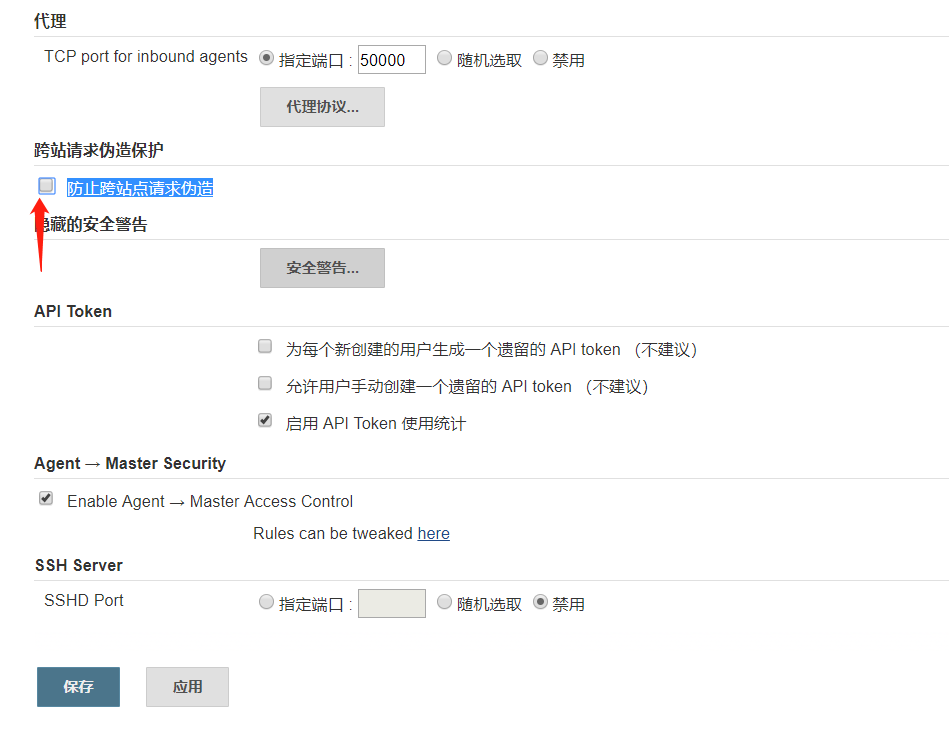

# Jenkins安装

## 构建docker镜像
- 下载Dockerfile  
wget https://www.gaozhengzhou.com/jenkins/Dockerfile

- 构建镜像  
docker build --tag=registry-vpc.cn-shenzhen.aliyuncs.com/lhs11/jenkins:latest .

- 推送镜像到私有仓库  
docker push registry-vpc.cn-shenzhen.aliyuncs.com/lhs11/jenkins:latest

## master节点部署
- 方法一：docker环境    
docker run -d --restart=unless-stopped -p 30010:8080 -v /var/run/docker.sock:/var/run/docker.sock -v /usr/bin/docker:/usr/bin/docker -v /data:/data registry-vpc.cn-shenzhen.aliyuncs.com/lhs11/jenkins:latest

- 方法二：kubernetes环境  
kubectl apply -f jenkins.yml  

```jenkins.yml
apiVersion: v1
kind: ServiceAccount
metadata:
  name: jenkins-serviceaccount
  namespace: ldx

---
apiVersion: rbac.authorization.k8s.io/v1beta1
kind: ClusterRole
metadata:
  name: jenkins-clusterrole
rules:
- apiGroups:
  - "extensions"
  - "apps"
  resources:
  - "deployments"
  verbs:
  - create
  - delete
  - get
  - list
  - watch
  - patch
  - update

- apiGroups:
  - ""
  resources:
  - "services"
  verbs:
  - create
  - delete
  - get
  - list
  - watch
  - patch
  - update

- apiGroups:
  - ""
  resources:
  - "pods"
  verbs:
  - create
  - delete
  - get
  - list
  - watch
  - patch
  - update

- apiGroups:
  - ""
  resources:
  - "pods/exec"
  verbs:
  - create
  - delete
  - get
  - list
  - watch
  - patch
  - update

- apiGroups:
  - ""
  resources:
  - "pods/log"
  verbs:
  - get
  - list
  - watch

- apiGroups:
  - ""
  resources:
  - "secrets"
  verbs:
  - get

---
apiVersion: rbac.authorization.k8s.io/v1beta1
kind: ClusterRoleBinding
metadata:
  name: jenkins-clusterrole-binding
  namespace: ldx
roleRef:
  apiGroup: rbac.authorization.k8s.io
  kind: ClusterRole
  name: jenkins-clusterrole
subjects:
- kind: ServiceAccount
  name: jenkins-serviceaccount
  namespace: ldx

---
kind: Deployment
apiVersion: extensions/v1beta1
metadata:
  name: jenkins
  namespace: ldx
  labels:
    k8s-app: jenkins
spec:
  replicas: 1
  selector:
    matchLabels:
      k8s-app: jenkins
  template:
    metadata:
      name: jenkins
      labels:
        k8s-app: jenkins
    spec:
      serviceAccountName: jenkins-serviceaccount
      containers:
      - name: jenkins
        image: registry-vpc.cn-shenzhen.aliyuncs.com/lhs11/jenkins:latest
        env:
        - name: POD_NAME
          valueFrom:
            fieldRef:
              fieldPath: metadata.name
        - name: POD_NAMESPACE
          valueFrom:
            fieldRef:
              fieldPath: metadata.namespace
        - name: JAVA_OPTS
          value: -Xms128m -Xmx4096m -Xss1m
        resources:
          requests:
            cpu: '0'
            memory: 256Mi
          limits:
            memory: 4096Mi
        imagePullPolicy: Always
        securityContext:
          privileged: false
          procMount: Default
        volumeMounts:
        - mountPath: /var/run/docker.sock
          name: docker-sock-volume
        - mountPath: /usr/bin/docker
          name: docker-bin-volume
        - mountPath: /data
          name: jenkins-volume
      volumes:
      - name: docker-sock-volume
        hostPath:
          path: /var/run/docker.sock
      - name: docker-bin-volume
        hostPath:
          path: /usr/bin/docker
      - name: jenkins-volume
        persistentVolumeClaim:
          claimName: nfs-jenkins-pvc
      restartPolicy: Always
      terminationGracePeriodSeconds: 60
      dnsPolicy: ClusterFirst
      securityContext: {}
      imagePullSecrets:
      - name: ldx-registry-key
      schedulerName: default-scheduler
  strategy:
    type: RollingUpdate
    rollingUpdate:
      maxUnavailable: 25%
      maxSurge: 25%
  revisionHistoryLimit: 10
  progressDeadlineSeconds: 600

---
kind: Service
apiVersion: v1
metadata:
  name: jenkins
  namespace: ldx
  labels:
    k8s-app: jenkins
spec:
  type: NodePort
  ports:
  - name: http
    protocol: TCP
    port: 9400
    targetPort: 8080
    nodePort: 30010
  - name: jnpl
    protocol: TCP
    port: 50000
    targetPort: 50000
  selector:
    k8s-app: jenkins

---
apiVersion: v1
kind: PersistentVolume
metadata:
  name: nfs-jenkins-pv
  namespace: ldx
spec:
  capacity:
    storage: 800Gi
  accessModes:
  - ReadWriteMany
  storageClassName: jenkins
  nfs:
    server: ffa534b1a3-npv76.cn-shenzhen.nas.aliyuncs.com
    path: "/"

---
apiVersion: v1
kind: PersistentVolumeClaim
metadata:
  name: nfs-jenkins-pvc
  namespace: ldx
spec:
  accessModes:
  - ReadWriteMany
  storageClassName: jenkins
  resources:
    requests:
      storage: 800Gi
```

## Jenkins安装向导
- 使用浏览器访问http://192.168.0.10:30010/，输入密码并继续  


- 默认配置下安装插件特慢，点击X关闭向导  


- 点击开始使用jenkins  


## 设置admin密码
- 点击People  


- 点击admin  


- 点击Configure


- 输入密码，然后保存  


## 关闭跨域保存 
- 点击Manage Jenkins  


- 点击Configure Global Security   


- 取消勾选Prevent Cross Site Request Forgery exploits，然后保存  


## 安装插件  
- 点击Manage Jenkins  


- 点击Manage Plugins  


- 点击Advanced    


- 删除jenkins服务器的default.json文件  
rm -f /data/jenkins/home/updates/default.json

- 在Update Site中输入https://www.gaozhengzhou.com/jenkins/default.json，然后保存    


- 点击Available      


- 选中安装以下插件  
```官方推荐
Folders
OWASP Markup Formatter
Build Timeout
Credentials Binding
Timestamper
Workspace Cleanup
Ant
Gradle
Pipeline
GitHub Branch Source
Pipeline: GitHub Groovy Libraries
Pipeline: Stage View
Git
Subversion
SSH Build Agents
Matrix Authorization Strategy
PAM Authentication
LDAP
Email Extension
Mailer
Localization: Chinese (Simplified)
```

```个人推荐
Role-based Authorization Strategy
```


