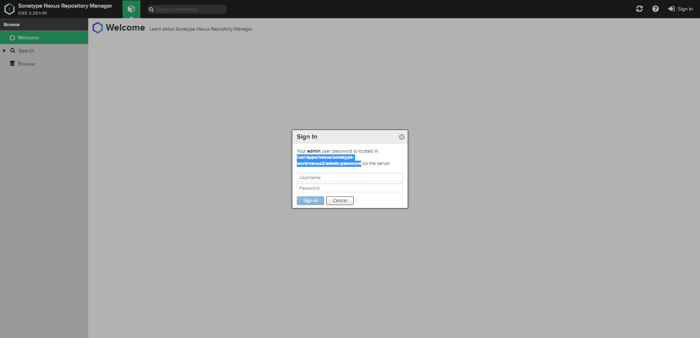

# Nexus安装

- 官网  
https://www.sonatype.com/nexus-repository-oss

- 下载  
wget -c https://sonatype-download.global.ssl.fastly.net/nexus/3/latest-unix.tar.gz

- 解压  

mkdir -p /usr/apps/nexus  
tar zxvf latest-unix.tar.gz -C /usr/apps/nexus

- 修改端口
  
vi /usr/apps/nexus/nexus-3.20.1-01/etc/nexus-default.properties  
```
# Jetty section
application-port=8099
application-host=0.0.0.0
nexus-args=${jetty.etc}/jetty.xml,${jetty.etc}/jetty-http.xml,${jetty.etc}/jetty-requestlog.xml
nexus-context-path=/

# Nexus section
nexus-edition=nexus-pro-edition
nexus-features=\
 nexus-pro-feature

nexus.hazelcast.discovery.isEnabled=true
```

- 修改jvm参数和数据存储目录  

vi /usr/apps/nexus/nexus-3.20.1-01/bin/nexus.vmoptions
```
-Xms2703m
-Xmx2703m
-XX:MaxDirectMemorySize=2703m
-XX:+UnlockDiagnosticVMOptions
-XX:+LogVMOutput
-XX:LogFile=../sonatype-work/nexus3/log/jvm.log
-XX:-OmitStackTraceInFastThrow
-Djava.net.preferIPv4Stack=true
-Dkaraf.home=.
-Dkaraf.base=.
-Dkaraf.etc=etc/karaf
-Djava.util.logging.config.file=etc/karaf/java.util.logging.properties
-Dkaraf.data=../sonatype-work/nexus3
-Dkaraf.log=../sonatype-work/nexus3/log
-Djava.io.tmpdir=../sonatype-work/nexus3/tmp
-Dkaraf.startLocalConsole=false
-Djava.endorsed.dirs=lib/endorsed
```

- 添加supervisor配置  

mkdir /usr/apps/nexus/logs  
vi /usr/apps/nexus/supervisor.conf  
```
[program:nexus]
command=/usr/apps/nexus/nexus-3.20.1-01/bin/nexus run              ; the program (relative uses PATH, can take args)
process_name=%(program_name)s ; process_name expr (default %(program_name)s)
numprocs=1                    ; number of processes copies to start (def 1)
directory=/usr/apps/nexus                ; directory to cwd to before exec (def no cwd)
umask=022                     ; umask for process (default None)
priority=999                  ; the relative start priority (default 999)
autostart=true                ; start at supervisord start (default: true)
autorestart=true              ; retstart at unexpected quit (default: true)
startsecs=10                  ; number of secs prog must stay running (def. 1)
startretries=3                ; max # of serial start failures (default 3)
exitcodes=0,2                 ; 'expected' exit codes for process (default 0,2)
stopsignal=QUIT               ; signal used to kill process (default TERM)
stopwaitsecs=10               ; max num secs to wait b4 SIGKILL (default 10)
user=root                   ; setuid to this UNIX account to run the program
redirect_stderr=true          ; redirect proc stderr to stdout (default false)
stdout_logfile=/usr/apps/nexus/logs/stdout.log        ; stdout log path, NONE for none; default AUTO
stdout_logfile_maxbytes=1MB   ; max # logfile bytes b4 rotation (default 50MB)
stdout_logfile_backups=10     ; # of stdout logfile backups (default 10)
stdout_capture_maxbytes=1MB   ; number of bytes in 'capturemode' (default 0)
stdout_events_enabled=false   ; emit events on stdout writes (default false)
stderr_logfile=/usr/apps/nexus/logs/stdout.log        ; stderr log path, NONE for none; default AUTO
stderr_logfile_maxbytes=1MB   ; max # logfile bytes b4 rotation (default 50MB)
stderr_logfile_backups=10     ; # of stderr logfile backups (default 10)
stderr_capture_maxbytes=1MB   ; number of bytes in 'capturemode' (default 0)
stderr_events_enabled=false   ; emit events on stderr writes (default false)
environment=A=1,B=2           ; process environment additions (def no adds)
serverurl=AUTO                ; override serverurl computation (childutils)
```

添加服务  
supervisorctl update

- yapi服务管理    

supervisorctl status nexus  
supervisorctl start nexus  
supervisorctl stop nexus  
supervisorctl restart nexus  

- 访问nexus    

http://serverip:8099/  



