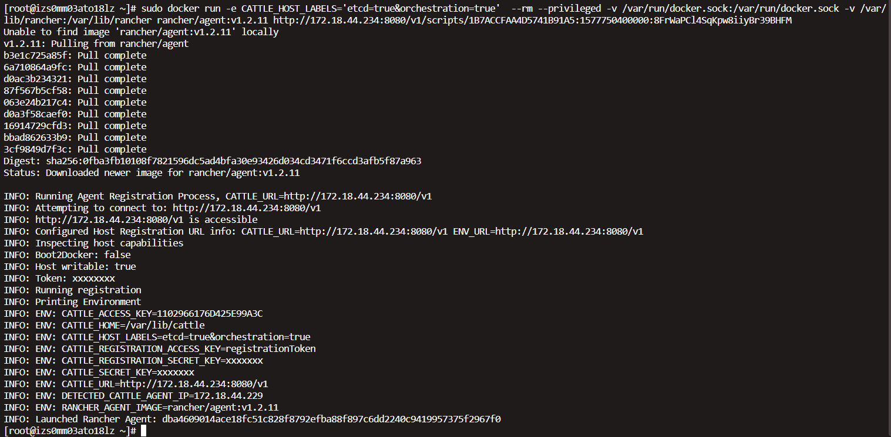
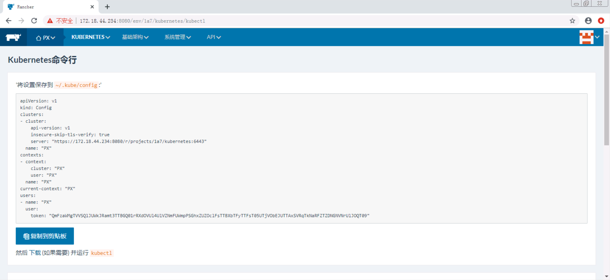

# Rancher1.6安装
## 环境准备
| 分类 | 主机名 | 规格 | 标签 |
| --- | --- | --- | --- |
| Rancher | PX-RANCHER | 2 vCPU 16 GiB | 无 |
| 数据平面/编排平面 | PX-K8SETCD1 | 2 vCPU 8 GiB | etcd=true orchestration=true |
| 数据平面/编排平面 | PX-K8SETCD2 | 2 vCPU 8 GiB | etcd=true orchestration=true |
| 数据平面/编排平面 | PX-K8SETCD3 | 2 vCPU 8 GiB | etcd=true orchestration=true |
| 计算平面 | PX-K8SNODE1 | 4 vCPU 32 GiB | compute=true |
| 计算平面 | PX-K8SNODE2 | 4 vCPU 32 GiB | compute=true |

> 每台服务器需要安装好docker，kubectl 

## 安装rancher服务器
- 在Rancher的ECS(IP: 172.18.44.234)执行  

`sudo docker run -d --restart=unless-stopped -v /data/rancher/mysql/:/var/lib/mysql/ -p 8080:8080 rancher/server`

- 然后在浏览器访问http://172.18.44.234:8080/

- 右下角切换语言  

- 点击系统管理->访问控制  

- 选择local  

- 输入用户名和密码，点击启用本地验证

## 创建K8S环境（在Rancher管理界面执行）
- 进入环境管理  

- 点击添加环境模板 

- 在名称输入“K8S隔离平面”， 在编排选择“Kubernetes”，然后点击“编辑设置”  

- 在模板版本选择当前默认， 在Plane Isolation选择required  

- dsf  

- dsf  

- dsf  

- dsf  

- dsf  

- dsf  

- dsf  

- dsf  

- dsf  

- dsf  

- dsf  

- dsf  

- dsf  

- dsf  

- dsf  

- dsf  

- dsf  

- dsf  

- dsf  

- dsf  

## 添加3台数据平面+编排平面节点（在数据平面+编排平面ECS执行）
示例（实际命令在Rancher管理界面生成）：  
`sudo docker run -e CATTLE_HOST_LABELS='etcd=true&orchestration=true'  --rm --privileged -v /var/run/docker.sock:/var/run/docker.sock -v /var/lib/rancher:/var/lib/rancher rancher/agent:v1.2.11 http://172.18.44.234:8080/v1/scripts/1B7ACCFAA4D5741B91A5:1577750400000:8FrWaPCl4SqKpw8iiyBr39BHFM`

## 添加3台计算平面节点（在计算平面ECS执行）
示例（实际命令在Rancher管理界面生成）：  
`sudo docker run -e CATTLE_HOST_LABELS='compute=true'  --rm --privileged -v /var/run/docker.sock:/var/run/docker.sock -v /var/lib/rancher:/var/lib/rancher rancher/agent:v1.2.11 http://172.18.44.234:8080/v1/scripts/1B7ACCFAA4D5741B91A5:1577750400000:8FrWaPCl4SqKpw8iiyBr39BHFM`

## \* 删除计算平面节点操作
ing