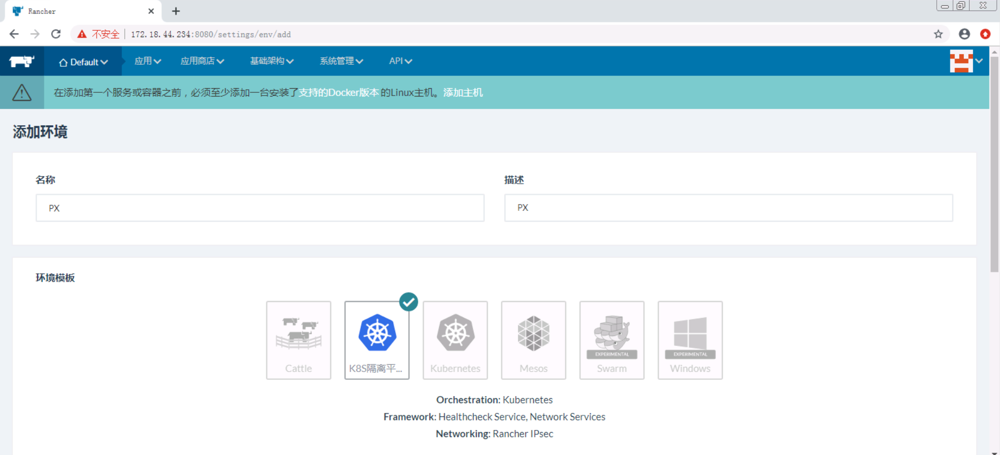

# Rancher1.6安装
## 环境准备
| 分类 | 主机名 | 规格 | 标签 |
| --- | --- | --- | --- |
| Rancher | PX-RANCHER | 2 vCPU 16 GiB | 无 |
| 数据平面/编排平面 | PX-K8SETCD1 | 2 vCPU 8 GiB | etcd=true orchestration=true |
| 数据平面/编排平面 | PX-K8SETCD2 | 2 vCPU 8 GiB | etcd=true orchestration=true |
| 数据平面/编排平面 | PX-K8SETCD3 | 2 vCPU 8 GiB | etcd=true orchestration=true |
| 计算平面 | PX-K8SNODE1 | 4 vCPU 32 GiB | compute=true |
| 计算平面 | PX-K8SNODE2 | 4 vCPU 32 GiB | compute=true |

> 每台服务器需要安装好docker，kubectl 

## 安装rancher服务器
- 在Rancher的ECS(IP: 172.18.44.234)执行  

`sudo docker run -d --restart=unless-stopped -v /data/rancher/mysql/:/var/lib/mysql/ -p 8080:8080 rancher/server`

- 然后在浏览器访问http://172.18.44.234:8080/

- 右下角切换语言  

- 点击系统管理->访问控制  

- 选择local  

- 输入用户名和密码，点击启用本地验证

## 创建K8S环境（在Rancher管理界面执行）
- 进入环境管理  

- 点击添加环境模板 

- 在名称输入“K8S隔离平面”， 在编排选择“Kubernetes”，然后点击“编辑设置”  

- 在模板版本选择当前默认， 在Plane Isolation选择required  

- 在Enable Rancher Ingress Controller勾选False  

- 点击设置  

- 点击创建  

- 点击添加环境  

- 输入名称和描述，在环境模板选择K8S隔离平面  

- 点击创建  

- 点击设置为缺省，点击切换至此环境  

- 点击添加主机  

- 勾选其他地址，输入rancher的内网地址，然后保存  

- 选择Custom  

- 在标签添加etcd=true和orchestration=true，获得数据平面+编排平面节点注册脚本   

- 在标签添加compute=true，获得计算平面节点注册脚本  

- 在第1台数据平面+编排平面节点执行注册脚本    
    `sudo docker run -e CATTLE_HOST_LABELS='etcd=true&orchestration=true'  --rm --privileged -v /var/run/docker.sock:/var/run/docker.sock -v /var/lib/rancher:/var/lib/rancher rancher/agent:v1.2.11 http://172.18.44.234:8080/v1/scripts/1B7ACCFAA4D5741B91A5:1577750400000:8FrWaPCl4SqKpw8iiyBr39BHFM`
  
    

- 点击基础架构->主机  

- 可以看到已注册的数据平面+编排平面节点  

- 数据平面+编排平面节点注册完成后，点击KUBERNETES->CLI，点击生成配置  

- 点击复制到剪贴板  

- 将设置保存到~/.kube/config文件，然后就可以使用kubectl命令了

- 然后在另外两台数据平面+编排平面节点执行注册脚本 

## 添加3台计算平面节点（在计算平面ECS执行）
- 分别在计算平面节点执行注册脚本  
    `sudo docker run -e CATTLE_HOST_LABELS='compute=true'  --rm --privileged -v /var/run/docker.sock:/var/run/docker.sock -v /var/lib/rancher:/var/lib/rancher rancher/agent:v1.2.11 http://172.18.44.234:8080/v1/scripts/1B7ACCFAA4D5741B91A5:1577750400000:8FrWaPCl4SqKpw8iiyBr39BHFM`
    
    

- 可以看到已注册的计算平面节点    

## \* 删除计算平面节点操作
- 点击基础架构->主机  

- 找到要删除的节点，点击停用  

- 找到要删除的节点，点击删除  

- 点击删除  

- 点击KUBERNETES->仪表板，点击Kubernetes UI   

- 选择ldx命名空间  

- 点击部署  

- 查看各服务是否正常  

- 在被删除的计算节点执行以下脚本清除rancher容器  
    `sudo curl https://www.gaozhengzhou.com/cleanup.sh > ./cleanup.sh && chmod a+x ./cleanup.sh && sudo ./cleanup.sh`  
    
    `for mount in $(mount | grep tmpfs | grep '/var/lib/kubelet' | awk '{ print $3 }') /var/lib/kubelet /var/lib/rancher; do sudo umount $mount; done`  
    
    `sudo rm -rf /etc/ceph /etc/cni /etc/kubernetes /opt/cni /opt/rke /run/secrets/kubernetes.io /run/calico /run/flannel /var/lib/calico /var/lib/etcd /var/lib/cni /var/lib/kubelet /var/lib/rancher/rke/log /var/log/containers /var/log/pods /var/run/calico`    

