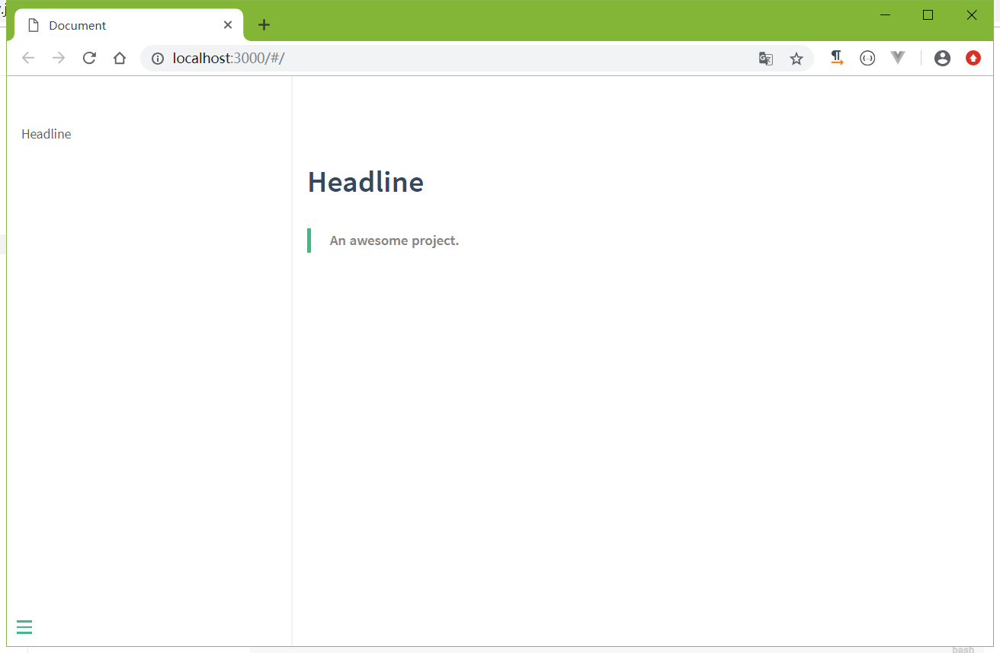
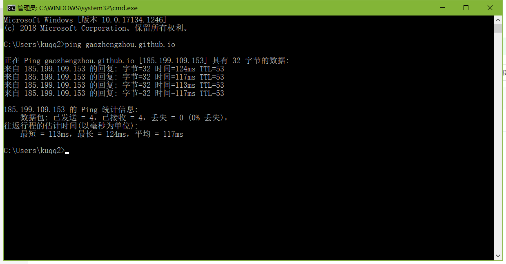

# 关于本站
本站使用GitHub Pages + Docsify搭建，使用GitHub Pages可以节省租用服务器的费用，
Docsify是一个动态生成文档网站的工具，样式清爽，支持markdown，不会生成多余的html文件。
## 知识点
    GitHub
    GitHub Pages
    NodeJs
    Npm
    Docsify
    Domain
## 创建github项目
- 注册github账号（略）
- 创建一个仓库blog


## 安装nodejs
到官方网站<https://nodejs.org/en/>下载并安装

## 淘宝 NPM 镜像
`npm install -g cnpm --registry=https://registry.npm.taobao.org`

## 使用docsify构建项目
- 安装docsify  
`cnpm install docsify-cli -g`

- 把github的blog项目克隆下来


- 创建docsify项目
```
    # 删除已有的README.md
    rm README.md -rf
    
    # 初始化项目
    docsify init .
    
    # 本地运行
    docsify serve .
```  


- 本地预览


- 提交代码到github

## 域名解析
- 注册域名（略）
- 解析域名

其中，gaozhengzhou为github用户名，185.199.110.153为ping gaozhengzhou.github.io解析的ip


## GitHub Pages配置
- 打开仓库blog，点击Settings


- 在source选择master branch, 在custom domain输入www.gaozhengzhou.com, 勾选Enforce HTTPS


## 使用Idea编辑网站
docsify帮助文档请看<https://docsify.js.org/>


## 访问网站

