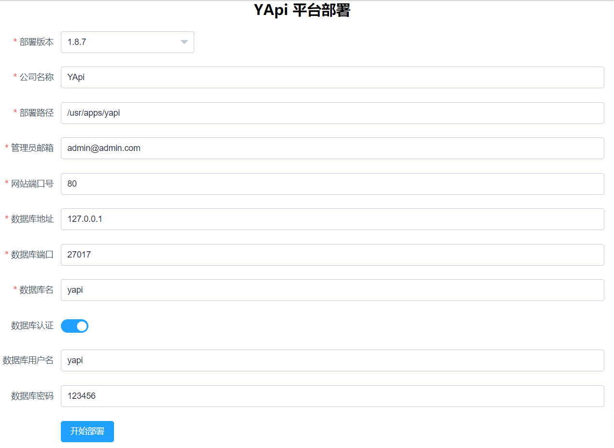
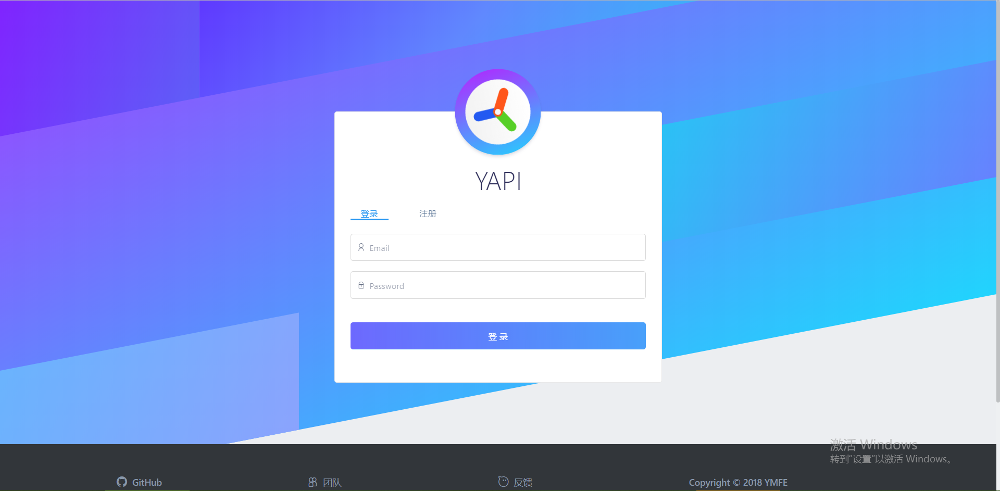

# YApi安装

### 项目源码
github: <https://github.com/YMFE/yapi>

### 环境准备
- 安装Node.js  
[Node.js安装](nodejs.md)  

- 安装mongodb    
[mongodb安装](mongodb.md)  

- 安装git  
yum install -y git


### 在mongodb安装数据库和账号
- 连接mongodb
mongodb

- 登录管理员账号  
db.auth(user: "root", pwd: "123456")

- 切换到yapi数据库  
use yapi

- 插入一条测试数据，让自动创建数据库  
db.yapi.insert({"name": "yapi"})

- 新增yapi账号，角色为dbOwner  
db.createUser({user:"yapi", pwd:"123456", roles:[{role:"dbOwner", db:"yapi"}]});

### 安装YApi
- 安装yapi-cli  
cnpm install -g yapi-cli

- 启动安装服务  
yapi server  
_在浏览器打开 http://0.0.0.0:9090 访问。非本地服务器，请将 0.0.0.0 替换成指定的域名或ip_

- 在浏览器打开安装界面, 然后输入对应信息后，点击开始部署


### 添加supervisor配置
vi /usr/apps/yapi/supervisor.conf
```
[program:yapi]
command=/opt/node-v12.15.0-linux-x64/bin/node /usr/apps/yapi/vendors/server/app.js              ; the program (relative uses PATH, can take args)
process_name=%(program_name)s ; process_name expr (default %(program_name)s)
numprocs=1                    ; number of processes copies to start (def 1)
directory=/usr/apps/yapi                ; directory to cwd to before exec (def no cwd)
umask=022                     ; umask for process (default None)
priority=999                  ; the relative start priority (default 999)
autostart=true                ; start at supervisord start (default: true)
autorestart=true              ; retstart at unexpected quit (default: true)
startsecs=10                  ; number of secs prog must stay running (def. 1)
startretries=3                ; max # of serial start failures (default 3)
exitcodes=0,2                 ; 'expected' exit codes for process (default 0,2)
stopsignal=QUIT               ; signal used to kill process (default TERM)
stopwaitsecs=10               ; max num secs to wait b4 SIGKILL (default 10)
user=root                   ; setuid to this UNIX account to run the program
redirect_stderr=true          ; redirect proc stderr to stdout (default false)
stdout_logfile=/usr/apps/yapi/log/stdout.log        ; stdout log path, NONE for none; default AUTO
stdout_logfile_maxbytes=1MB   ; max # logfile bytes b4 rotation (default 50MB)
stdout_logfile_backups=10     ; # of stdout logfile backups (default 10)
stdout_capture_maxbytes=1MB   ; number of bytes in 'capturemode' (default 0)
stdout_events_enabled=false   ; emit events on stdout writes (default false)
stderr_logfile=/usr/apps/yapi/log/stdout.log        ; stderr log path, NONE for none; default AUTO
stderr_logfile_maxbytes=1MB   ; max # logfile bytes b4 rotation (default 50MB)
stderr_logfile_backups=10     ; # of stderr logfile backups (default 10)
stderr_capture_maxbytes=1MB   ; number of bytes in 'capturemode' (default 0)
stderr_events_enabled=false   ; emit events on stderr writes (default false)
environment=A=1,B=2           ; process environment additions (def no adds)
serverurl=AUTO                ; override serverurl computation (childutils)
```

添加服务  
supervisorctl update

### yapi服务管理  
supervisorctl status yapi  
supervisorctl start yapi  
supervisorctl stop yapi  
supervisorctl restart yapi  

### 访问YApi
账号为安装界面输入的管理员邮箱，默认密码是ymfe.org   

